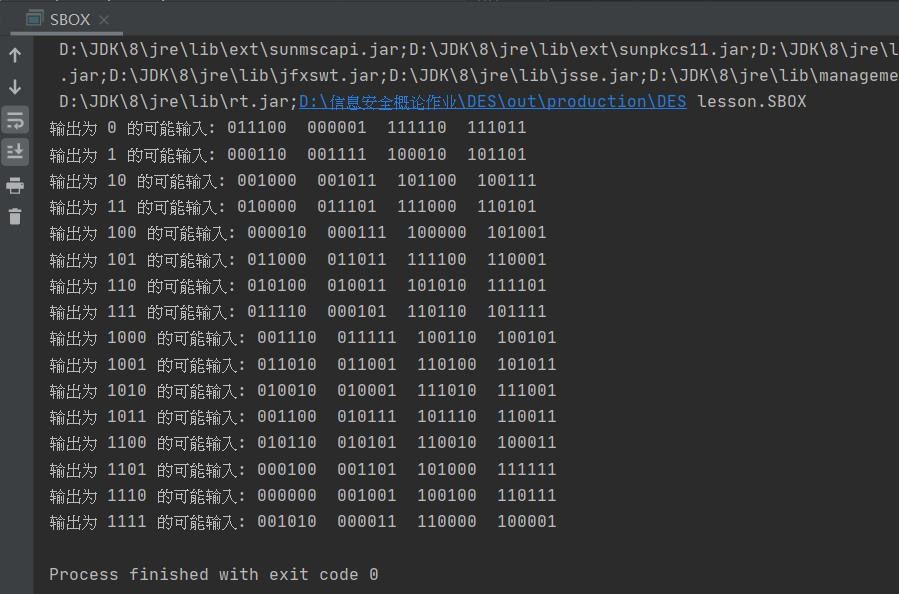
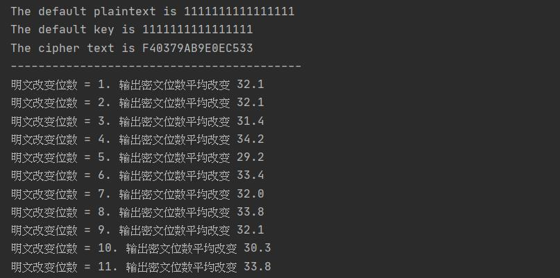
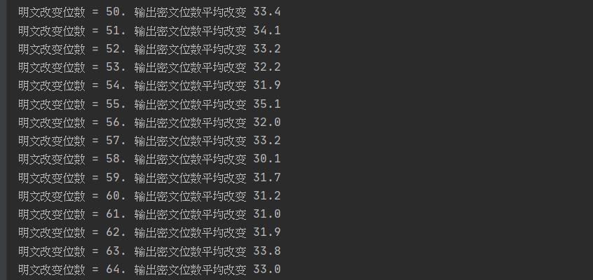
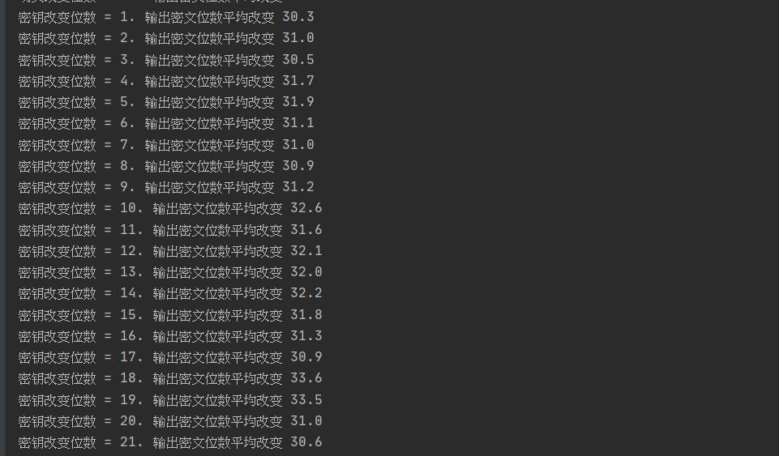
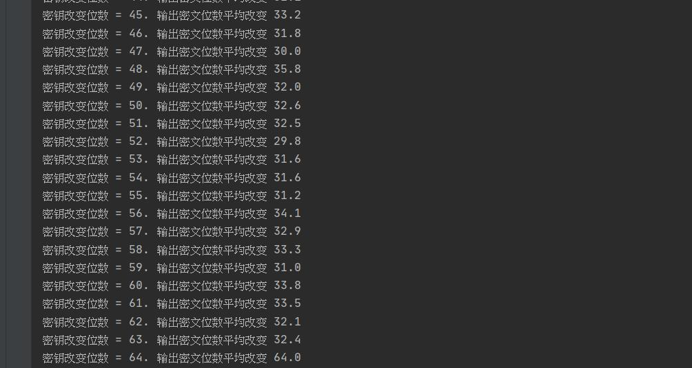

## DES算法

#### 1、源代码 

[DES](src/lesson/DES.java)

#### 2、利用DES源代码实现下面功能： 

##### (1)给定某个Sbox的输入差分情况下，计算所有输入对和所有Sbox输出差分的分布情况 

**测试源代码：**

[sbox](src/lesson/SBOX.java)

**测试数据：**

```java
S_BOX[0][][] =
{
        {14,4,13,1,2,15,11,8,3,10,6,12,5,9,0,7},
        {0,15,7,4,14,2,13,1,10,6,12,11,9,5,3,8},
        {4,1,14,8,13,6,2,11,15,12,9,7,3,10,5,0},
        {15,12,8,2,4,9,1,7,5,11,3,14,10,0,6,13}
},
```

**输出结果：**



##### (2)统计DES算法在密钥固定情况，输入明文改变1位、2位......64位时。输出密文位数改变情况。

**测试数据：**

```java
默认明文为1111111111111111
默认密钥为1111111111111111
```

**输出结果：**





##### (3)统计DES算法在明文固定情况，输入密钥改变1位、2位......64位时。输出密文位数改变情况。

**输出结果：**

##### 

