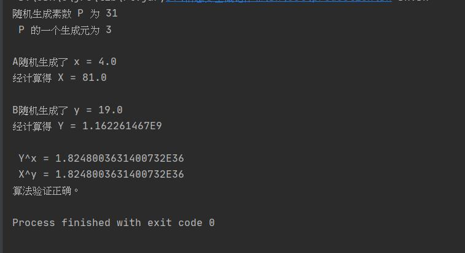
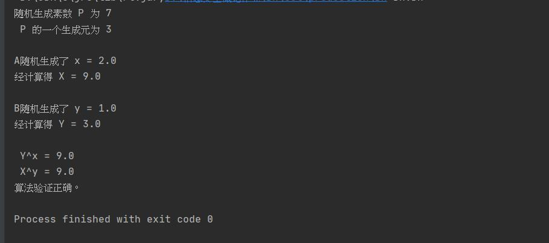

## 编程实现 DH 密钥协商协议 


共同参数。素数P，P的一个生成元g

1. A 随机选择一个 [1,p-1] 范围内的数`x`，计算 `X` = g^x 
2. B 随机选择一个 [1,p-1] 范围内的数`y`，计算 `Y` = g^y mod p, 并将结果发送给A。 
   k` = Y^x = X^y 
   提示 
   编写 bool isPrime(int n) ; 判断 n是素数 
   编写 int GCD(int a, int b); 计算 a，b最大公因子 
   编写 int ExpMod(int b, int n, int m) 计算 b^n mod m . 
   编写 bool isPrimeRoot(g, p); 判断 g是模p乘的生成元。 
   寻找p的生成元 ，从 g 从2，3等较小的数开始进行穷举。 计算 g^n mod p ， 1<=n < p-1 的到的数据不同，g即为生成元。 


#### 代码思路

随机生成0到100的一个素数P，然后取其第一个生成元作为g，A随机生成一个x，计算出X，B随机生成一个y，计算出Y，最后进行验证。


#### 代码实现

##### **编写 bool isPrime(int n) ; 判断 n是素数** 。

```java
boolean isPrime(int n) {
    int prime = 2; 
    while(prime < n){
        if(n % prime == 0){
            break;
        } else {
            prime++;
        }
    }
    if(prime >= n){
        return true;
    }
    return false;
}
```

##### **编写 int GCD(int a, int b); 计算 a，b最大公因子** 。

```java
int GCD(int a, int b) {
    if (a > b && a % b == 0){
        return b;
    }else {
        return GCD(a, (a % b));
    }
}
```

##### 编写 int ExpMod(int b, int n, int m) 计算 b^n mod m 。

```java
Double ExpMod(int b, int n, int m) {
    Double result;
    result = Math.pow(b, n) % m;
    return result;
}
```

##### **编写 bool isPrimeRoot(g, p); 判断 g是模p乘的生成元。**

```java
boolean isPrimeRoot(int g, int p) {
    double n;
    HashSet<Double> hashSet = new HashSet<>();
    for(int j = 1; j < p; j++) {
        n = ExpMod(g, j, p);
        hashSet.add(n);
    }
    if(hashSet.size() == p - 1) {
        return true;
    }
    return false;
}
```


#### 源代码

DH:[DH](src/DH/DH.java)


#### 运行结果

**结果1：**



算法验证正确。

**结果2：**



算法验证正确。