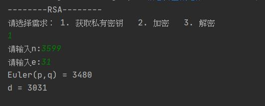
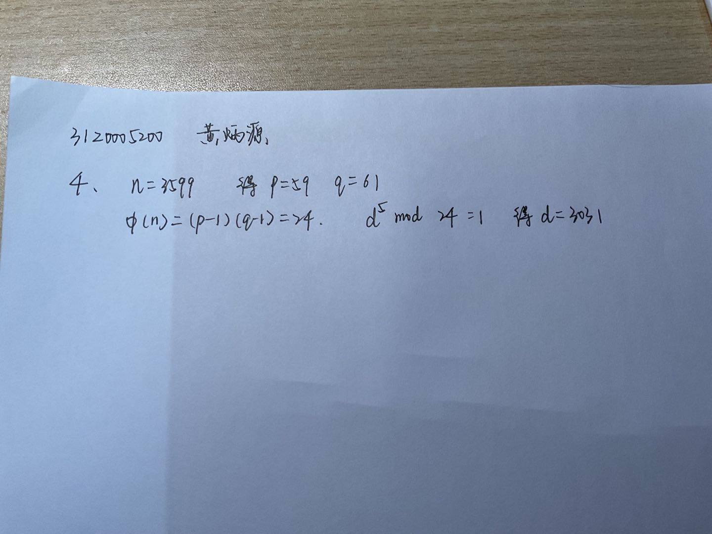
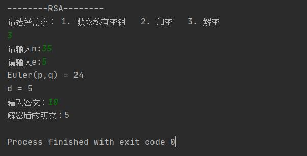
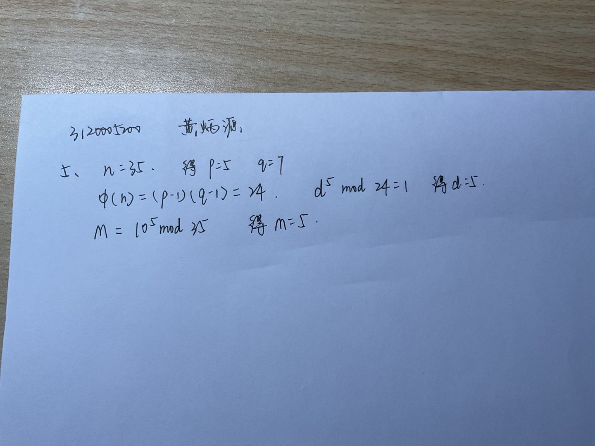

### 编程实现RSA基本算法 

课本 P68。 第4，5题 


#### 源代码

RSA：[RSA](src/RSA/RSA.java)


#### 测试结果

**加密**

```java
n:3599
e:31
明文：5
```


**解密**

```java
n:3599
e:31
密文：10
```


**4.在一个RSA系统中, 一个给定用户的公开密钥是e=31, n=3599。求这个用户的私有密钥。**

**程序运行结果**：



**作业本**：



**5.使用RSA公钥系统中如果截取了发送给其他用户的密文C =10，若此用户的公钥为e=5，n=35，请问明文的内容是什么？**

**程序运行结果：**



**作业本：**



