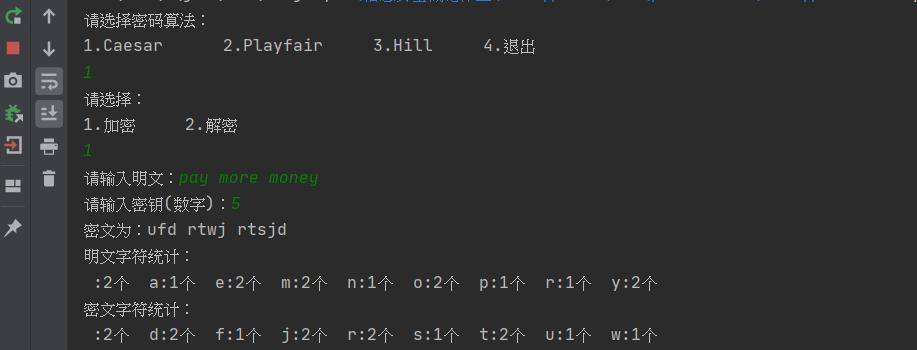

## 古典密码算法

**运行界面**

### Caesar

**支持操作**：加密，解密

**示例数据**：明文：pay more money

​                   密钥：5

​                   密文：ufd rtwj rtsjd

**运行结果**

加密：

解密：

### Playfair

**支持操作**：加密

**示例数据**：明文：pay more money

​				   密钥：monarchy

**运行结果**

### Hill

**支持操作**：加密

**示例数据**：明文：pay more money

​				   密钥：
$$
K = \left[
\matrix{
  17 & 17 & 5\\
  21 & 18 & 21\\
  2 & 2 & 19 
}
\right]
$$
**运行结果**

