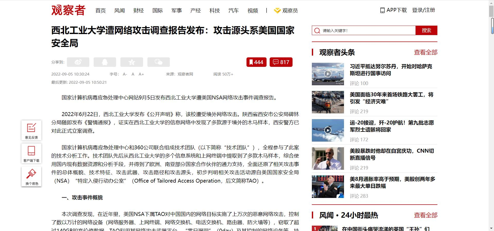

## 西工大被攻击事件

[西工大被攻击事件]: https://www.guancha.cn/politics/2022_09_05_656620.shtml?s=zwyxgtjbt

+ 国家计算机病毒应急处理中心网站9月5日发布西北工业大学遭美国NSA网络攻击事件调查报告。
+ 2022年6月22日，西北工业大学发布《公开声明》称，该校遭受境外网络攻击。陕西省西安市公安局碑林分局随即发布《警情通报》，证实在西北工业大学的信息网络中发现了多款源于境外的木马样本，西安警方已对此正式立案调查。
+ 国家计算机病毒应急处理中心和360公司联合组成技术团队（以下简称“技术团队”），全程参与了此案的技术分析工作。技术团队先后从西北工业大学的多个信息系统和上网终端中提取到了多款木马样本，综合使用国内现有数据资源和分析手段，并得到了欧洲、南亚部分国家合作伙伴的通力支持，全面还原了相关攻击事件的总体概貌、技术特征、攻击武器、攻击路径和攻击源头，初步判明相关攻击活动源自美国国家安全局（NSA）“特定入侵行动办公室”（Office of Tailored Access Operation，后文简称TAO）。

+ 无序列表
+ 无序列表
+ 无序列表
+ 无序列表

1. 有序列表
2. 有序列表
3. 有序列表

